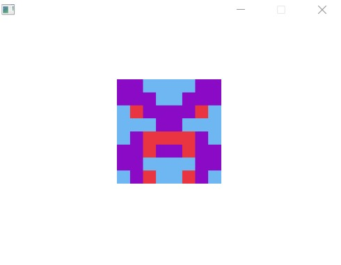

# blockies4j

This is a simple port of https://github.com/alexvandesande/blockies to a JavaFx Canvas component.


## Example
 
***This example is also available in test/BlockiesTest.java***
 
After setup a new JavaFx project, in the _start()_ method it's necessary to instantiate a Layout (e.g. BorderPane) which will be the Parent of the future blockie component. 
 

```java
BorderPane p = new BorderPane();
```

Then adjust the Scene setting according to your needs and set the current scene of the primaryStage.

```java
Scene scene = new Scene(p, YOUR_WIDTH, YOUR_HEIGHT);
primaryStage.setScene(scene);
```

Now, instantiate a new blockie. In order to do that, the constructor support 3 types of calls:

```java
blockie = new Blockies("0x00000000219ab540356cBB839Cbe05303d7705Fa", 8, 16); //Create an Identicon using the first parameter as a seed, the second as size and the third as the scale.
blockie = new Blockies("0x00000000219ab540356cBB839Cbe05303d7705Fa");  //Creates an Identicon using the argument as a seed, with default size and scale (resp. 8 and 15).
blockie = new Blockies(); //Creates a random seed Identicon, with default size and scale (resp. 8 and 15).   
```

Finally, we can add the blockie object to the BorderPane and show the scene:

```java
p.setCenter(blockie);
primaryStage.show();
```

## Result:




